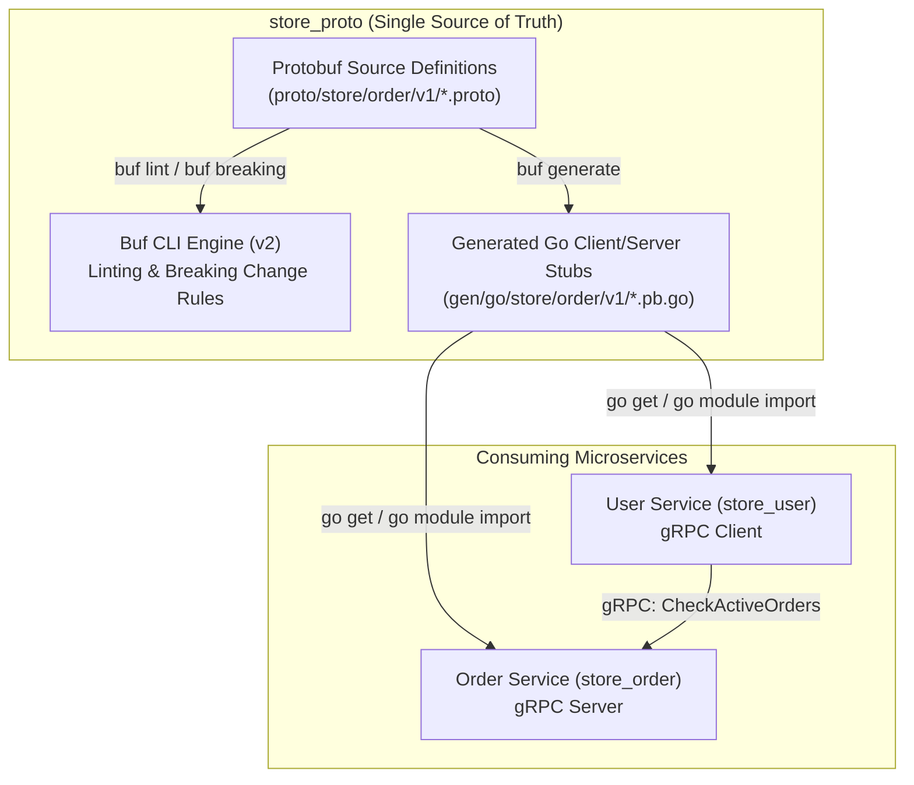
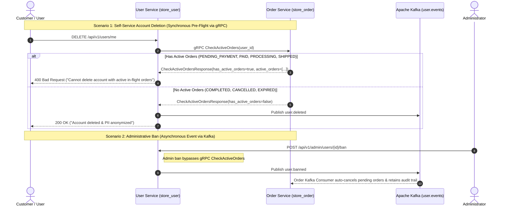
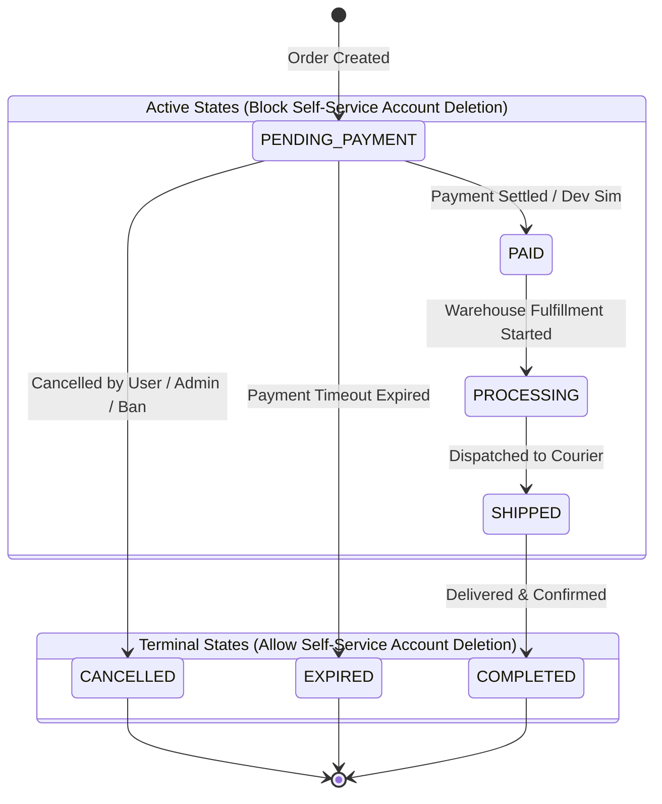

# Store Protobuf & gRPC Contracts (`store_proto`)

[](https://go.dev/)
[](https://protobuf.dev/)
[](https://buf.build/)
[](https://grpc.io/)
[](https://grpc.io/)

A centralized Protocol Buffers and gRPC contract repository for the store microservices platform. It acts as the single source of truth for inter-service RPC definitions, shared data models, and status enumerations across all microservices (such as `store_order` and `store_user`). Managed with the modern **Buf v2** toolchain, this repository automates linting, breaking change enforcement, and Go stub generation.

---

## 📑 Table of Contents

- [Architecture Overview](#-architecture-overview)
- [Key Features & Design Principles](#-key-features--design-principles)
- [Proto Packages & Service Catalog](#-proto-packages--service-catalog)
- [Repository Structure](#-repository-structure)
- [Prerequisites & Tooling Setup](#-prerequisites--tooling-setup)
- [Buf Tooling & Local Generation](#-buf-tooling--local-generation)
- [Consuming Generated Code in Go](#-consuming-generated-code-in-go)
- [Contribution & Versioning Workflow](#-contribution--versioning-workflow)

---

## 🏗 Architecture Overview

The `store_proto` repository centralizes all inter-service interface definitions to decouple microservice implementations while guaranteeing compile-time type safety and backward compatibility.



### Inter-Service Communication Flow (User Deletion vs Admin Ban)

The gRPC contract enforces an explicit distinction between synchronous user-initiated operations and asynchronous administrative events:



### Order Lifecycle State Machine

The order lifecycle states defined in `order_status.proto` govern whether an account deletion request is permitted:



---

## 🌟 Key Features & Design Principles

1. **Single Source of Truth**: Eliminates schema fragmentation and runtime contract discrepancies between independent backend services.
2. **Buf v2 Workspace Standards**: Governed by strict protobuf style guides and standard Google APIs conventions configured in `buf.yaml`.
3. **Automated Backward Compatibility**: Breaking change detection against the main Git branch (`buf breaking`) guarantees non-disruptive schema evolutions.
4. **Clean Go Module Stubs**: Emits pure Go models and gRPC stubs directly under `gen/go/` mapped to the canonical `github.com/Sall-lah/store_proto` Go module.
5. **Zero External Runtime Overhead**: Client and server stubs are lightweight, highly performant, and rely only on standard `google.golang.org/protobuf` and `google.golang.org/grpc`.

---

## 📦 Proto Packages & Service Catalog

### Package: `store.order.v1`

- **Proto Source**: [`proto/store/order/v1/order_service.proto`](proto/store/order/v1/order_service.proto), [`proto/store/order/v1/order_status.proto`](proto/store/order/v1/order_status.proto)
- **Go Package**: `github.com/Sall-lah/store_proto/gen/go/store/order/v1` (`orderv1`)

#### 1. `OrderService` RPCs

| RPC Method | Request Message | Response Message | Description |
| :--- | :--- | :--- | :--- |
| `CheckActiveOrders` | `CheckActiveOrdersRequest` | `CheckActiveOrdersResponse` | Evaluates if a user has active in-flight orders that block self-service account deletion. |

#### 2. Message Definitions

##### `CheckActiveOrdersRequest`
| Field | Type | Description |
| :--- | :--- | :--- |
| `user_id` | `string` | Unique identifier of the user requesting account deletion. |

##### `CheckActiveOrdersResponse`
| Field | Type | Description |
| :--- | :--- | :--- |
| `has_active_orders` | `bool` | `true` if user has one or more orders in active states (`PENDING_PAYMENT`, `PAID`, `PROCESSING`, `SHIPPED`). |
| `active_order_count` | `int32` | Total count of blocking in-flight orders. |
| `active_orders` | `repeated ActiveOrderSummary` | Metadata list of active orders causing rejection. |
| `message` | `string` | Human-readable explanation of the validation outcome. |

##### `ActiveOrderSummary`
| Field | Type | Description |
| :--- | :--- | :--- |
| `order_id` | `string` | Order UUID. |
| `order_number` | `string` | Human-readable reference number (e.g. `ORD-20260823-1234`). |
| `status` | `OrderStatus` | Current lifecycle state enum value. |
| `total_amount` | `double` | Gross order transaction amount. |
| `created_at` | `string` | ISO 8601 creation timestamp string. |

#### 3. `OrderStatus` Enum

| Enum Identifier | Number | Classification | Description |
| :--- | :--- | :--- | :--- |
| `ORDER_STATUS_UNSPECIFIED` | `0` | Default / Unset | Default fallback value. |
| `ORDER_STATUS_PENDING_PAYMENT` | `1` | **Active** (Blocks Deletion) | Order placed; awaiting Midtrans payment settlement. |
| `ORDER_STATUS_PAID` | `2` | **Active** (Blocks Deletion) | Payment confirmed; awaiting warehouse processing. |
| `ORDER_STATUS_PROCESSING` | `3` | **Active** (Blocks Deletion) | Order being packed and prepared for shipment. |
| `ORDER_STATUS_SHIPPED` | `4` | **Active** (Blocks Deletion) | Order in transit with courier. |
| `ORDER_STATUS_COMPLETED` | `5` | **Terminal** (Allows Deletion) | Delivered and confirmed. |
| `ORDER_STATUS_CANCELLED` | `6` | **Terminal** (Allows Deletion) | Explicitly cancelled by customer, admin, or ban event. |
| `ORDER_STATUS_EXPIRED` | `7` | **Terminal** (Allows Deletion) | Payment window expired without completion. |

---

## 📁 Repository Structure

```
store_proto/
├── buf.gen.yaml                    # Buf code generation plugin configuration (v2)
├── buf.yaml                        # Buf module configuration, linting, and breaking change rules (v2)
├── gen/
│   └── go/                         # Generated Go stubs and Protobuf data structures
│       └── store/
│           └── order/
│               └── v1/
│                   ├── order_service.pb.go       # Protobuf message structs & serializers
│                   ├── order_service_grpc.pb.go  # gRPC Client & Server interfaces
│                   └── order_status.pb.go        # OrderStatus enum definitions & string mapping
├── openspec/                       # OpenSpec change management & architectural specifications
├── proto/                          # Canonical Protobuf source definitions
│   └── store/
│       └── order/
│           └── v1/
│               ├── order_service.proto           # OrderService RPC interface
│               └── order_status.proto            # OrderStatus enumeration
├── go.mod                          # Go module configuration (Go 1.26)
├── go.sum                          # Go dependency checksums
└── README.md                       # Central repository documentation
```

---

## ⚙️ Prerequisites & Tooling Setup

### Prerequisites
- **Go**: Version 1.26 or higher
- **Buf CLI**: Version 2.x+ (`v2`)
- **protoc-gen-go**: `v1.36.5` or higher
- **protoc-gen-go-grpc**: `v1.71.0` or higher

### Tooling Installation

1. **Install Buf CLI**:
   ```bash
   # Via Go
   go install github.com/bufbuild/buf/cmd/buf@latest

   # Via Homebrew (macOS/Linux)
   brew install bufbuild/buf/buf

   # Via npm
   npm install -g @bufbuild/buf
   ```

2. **Install Protoc Go Plugins**:
   ```bash
   go install google.golang.org/protobuf/cmd/protoc-gen-go@latest
   go install google.golang.org/grpc/cmd/protoc-gen-go-grpc@latest
   ```

3. **Verify PATH**: Ensure `$GOPATH/bin` (or `%USERPROFILE%\go\bin` on Windows) is in your system `PATH`.

---

## 🚀 Buf Tooling & Local Generation

### 1. Lint Protobuf Files
Enforces Google API style guide rules and standard conventions:
```bash
buf lint
```

### 2. Check for Breaking Changes
Verifies that schema edits are backward-compatible against the `main` branch:
```bash
buf breaking --against ".git#branch=main"
```

### 3. Generate Go Code
Runs the plugins defined in `buf.gen.yaml` to regenerate Go stubs under `gen/go/`:
```bash
buf generate
```

### Configuration Files

#### `buf.yaml` (Module & Rules)
```yaml
version: v2
modules:
  - path: proto
lint:
  use:
    - STANDARD
breaking:
  use:
    - FILE
```

#### `buf.gen.yaml` (Generation Target)
```yaml
version: v2
plugins:
  - local: protoc-gen-go
    out: gen/go
    opt:
      - paths=source_relative
  - local: protoc-gen-go-grpc
    out: gen/go
    opt:
      - paths=source_relative
```

---

## 🔌 Consuming Generated Code in Go

Downstream microservices (such as `store_user` and `store_order`) import the generated Go package directly.

### 1. Install Module Dependency
```bash
go get github.com/Sall-lah/store_proto@latest
```

### 2. Client Example (`store_user`)
```go
package main

import (
	"context"
	"log"
	"time"

	orderv1 "github.com/Sall-lah/store_proto/gen/go/store/order/v1"
	"google.golang.org/grpc"
	"google.golang.org/grpc/credentials/insecure"
)

func CheckUserOrders(orderServiceAddr, userID string) (*orderv1.CheckActiveOrdersResponse, error) {
	conn, err := grpc.NewClient(orderServiceAddr, grpc.WithTransportCredentials(insecure.NewCredentials()))
	if err != nil {
		return nil, err
	}
	defer conn.Close()

	client := orderv1.NewOrderServiceClient(conn)

	ctx, cancel := context.WithTimeout(context.Background(), 3*time.Second)
	defer cancel()

	resp, err := client.CheckActiveOrders(ctx, &orderv1.CheckActiveOrdersRequest{
		UserId: userID,
	})
	if err != nil {
		return nil, err
	}

	return resp, nil
}
```

### 3. Server Implementation Example (`store_order`)
```go
package grpcserver

import (
	"context"

	orderv1 "github.com/Sall-lah/store_proto/gen/go/store/order/v1"
)

type OrderGrpcHandler struct {
	orderv1.UnimplementedOrderServiceServer
	// Injected services/repositories
}

func (h *OrderGrpcHandler) CheckActiveOrders(
	ctx context.Context,
	req *orderv1.CheckActiveOrdersRequest,
) (*orderv1.CheckActiveOrdersResponse, error) {
	userID := req.GetUserId()

	// Query active in-flight orders from database
	// ...

	return &orderv1.CheckActiveOrdersResponse{
		HasActiveOrders:  false,
		ActiveOrderCount: 0,
		ActiveOrders:     []*orderv1.ActiveOrderSummary{},
		Message:          "User has no active in-flight orders.",
	}, nil
}
```

---

## 🔄 Contribution & Versioning Workflow

1. **Create Feature Branch**:
   ```bash
   git checkout -b feat/add-service-proto
   ```
2. **Add / Modify `.proto` Files**: Place new schemas inside `proto/store/<service>/v<version>/`.
3. **Verify Conventions & Compatibility**:
   ```bash
   buf lint
   buf breaking --against ".git#branch=main"
   ```
4. **Generate Code**:
   ```bash
   buf generate
   ```
5. **Commit Both Schemas & Generated Stubs**:
   ```bash
   git add proto/ gen/
   git commit -m "feat(order): add active order check gRPC definition"
   ```
6. **Tag Release**: Push semantic version tags (e.g. `v0.1.0`) so Go clients can pin specific revisions.
